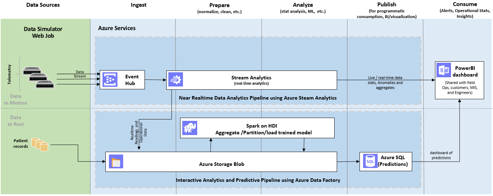

# Patient-Specific Readmission Prediction and Intervention for Health Care 

In health care domain, a hospital readmission is defined as an admission to a hospital within a certain time frame following the discharge from the original hospital stay. Hospital readmissions are often associated with high financial costs and unfavorable patient outcomes. For example,  one study demonstrates that almost 20 percent of Medicare patients discharged from a hospital are readmitted within 30 days. In terms of cost, these unplanned readmissions incur 17.4 billion dollars annually [[1,2]](#reference). Therefore, preventing avoidable re-hospitalizations is imperative. To target this problem, one important metric that researchers and practitioners strive to reduce is the 30-day hospital readmission rate. Among many initiatives that aim to reduce this metric, a common approach is to assign post-discharge intervention programs for supporting discharged patients. Example programs include post-discharge care coordination, patient education and self-management support, scheduled outpatient visits, telemedicine, etc. However, it is not economically feasible to provide such programs to all patients. Therefore, a decision need to be made for assigning intervention programs to high risk patients.

This solution showcases a decision system that utilizes patient-specific prediction to guide the suggestion of performing an intervention program, with the objective of minimizing the patients' readmission cost. It addresses the problem of reducing the 30-day hospital readmission rate, and ultimately reducing readmission cost from two aspects. First, it takes a data driven approach by training a machine learning model to identify patients with higher risk of within 30-day readmission. Second, it incorporates an evaluation analysis process to make decision on whether or not to assign a post-discharge intervention program to a patient at discharge.

This solution aims to benefit two types of users: the hospital managers who oversee the  overall performance of patient-specific readmission prediction model and the intervention programs, and the doctors who make decisions on the medical care for individual patient.

## What's Under the Hood     

This solution is built with [Cortana Intelligence suite](https://azure.microsoft.com/en-us/suites/cortana-intelligence-suite/) and [Power BI](https://powerbi.microsoft.com/en-us/what-is-power-bi/). The former is an advanced analyitcs cloud platform based on Microsoft Azure services. And the latter is a data visualization and analysis tool, including Power BI Desktop and Power BI online. The solution is composed of several Azure components, including data ingest, data storage, data movement, and advanced analytics. The advanced analtyics are implemented in Azure HDInsight Spark cluster using pySpark language.

### Solution Architecture

In this solution guide, we first construct a classifier based on patients’ demographic information (age, gender, zip code), medical record history (e.g. present illness, physical exam results, and medication), and glucose readings to stratify patients into different readmission risk groups. The glucose sensor reading data is simulated, and other data is obtained from UCI Data Repository - *Diabetes 130-US hospitals for years 1999-2008 Data Set* [[3]](#reference). This classifier is trained offline and used for scoring. 

The below solution architecture diagram illustrates the scoring pipeline. The simulated patient glucose data is generated via the *Data Simulator Web Job* and ingested into the *Event Hub*. It is then being aggregated in *Stream Analytics* and sinks in *Azure Storage Blob*. These data then serves the raw scoring data, which goes through sequential steps such as data preprocessing, feature engineering, and scoring with the pre-trained classifier (get predictions of the probability of 30-day readmission). All these procedures are implemented using pySpark. *Azure Data Factory* is used to schedule scoring at daily basis for patients at discharge every day, as well as copying the results from *Azure Storage Blob* to *Azure SQL* database.

### Solution Dashboard 

In Power BI visualizations, we present a decision system that uses the predictions from the classifier to guide decisions about post-discharge interventions. With a set of tunable parameters such as per patient readmission cost, cost of the intervention program, and efficacy of the intervention programs [[4]](*reference), we report the performance of the methodology and show the overall expected value of employing a real-time decision system.

There are [two report pages](https://msit.powerbi.com/view?r=eyJrIjoiZjJjOTkyM2QtYTU4OS00NDU5LThkMjctNThjM2VlOGJmNWVlIiwidCI6IjcyZjk4OGJmLTg2ZjEtNDFhZi05MWFiLTJkN2NkMDExZGI0NyIsImMiOjV9) included in the dashboard. The CMIO report aims to serve the management team such as the chief medical information officer for high level performance of this patient-specific prediction and interventions assignment system. By comparing different intervention programs with varying cost and efficacy, the manager can obtain the expected cost savings of lost.  

The doctor report shows the patient level information to doctors who need to make decision on patient-specific intervention program suggestions. 

## Getting Started

See the **[Manual Deployment Guide](https://github.com/Azure/cortana-intelligence-population-health-management/tree/master/Spark/Manual%20Deployment%20Guide)** folder for a full set of instructions on how to deploy the end-to-end pipeline, including a step-by-step walkthrough and files containing all the scripts that you’ll need to deploy resources. **For technical problems or questions about deploying this solution, please post in the issues tab of the repository.**

## Reference

1.  Jencks SF, Williams MV, Coleman EA. Rehospitalizations among patients in the Medicare fee-for-service program. N Engl J Med. Apr 2 2009; 360(14):1418-1428. 

2.  [Betancourt JR, Tan-McGrory A, Kenst KS. Guide to Preventing Readmissions among Racially and Ethnically Diverse Medicare Beneficiaries. Prepared by the Disparities Solutions Center, Mongan Institute for Health Policy at Massachusetts General Hospital. Baltimore, MD: Centers for Medicare & Medicaid Services Office of Minority Health; September 2015.](https://www.cms.gov/About-CMS/Agency-information/OMH/Downloads/OMH_Readmissions_Guide.pdf) 

3. [Beata Strack, Jonathan P. DeShazo, Chris Gennings, Juan L. Olmo, Sebastian Ventura, Krzysztof J. Cios, and John N. Clore, “Impact of HbA1c Measurement on Hospital Readmission Rates: Analysis of 70,000 Clinical Database Patient Records,” BioMed Research International, vol. 2014, Article ID 781670, 11 pages, 2014.](https://archive.ics.uci.edu/ml/datasets/Diabetes+130-US+hospitals+for+years+1999-2008)

4. [Bayati M, Braverman M, Gillam M, Mack KM, Ruiz G, et al. (2014) Data-Driven Decisions for Reducing Readmissions for Heart Failure: General Methodology and Case Study. PLoS ONE 9(10): e109264. doi:10.1371/journal.pone.0109264](http://journals.plos.org/plosone/article?id=10.1371/journal.pone.0109264#pone.0109264.s001)

This project has adopted the [Microsoft Open Source Code of Conduct](https://opensource.microsoft.com/codeofconduct/). For more information see the [Code of Conduct FAQ](https://opensource.microsoft.com/codeofconduct/faq/) or contact [opencode@microsoft.com](mailto:opencode@microsoft.com) with any additional questions or comments.
